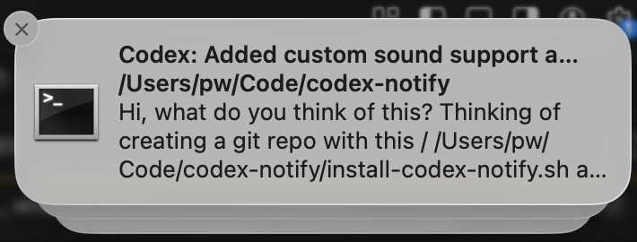

# Codex Notify

macOS notifications for Codex with reliable VSCode activation. (macOS-only.)

[](https://github.com/paultendo/codex-notify/actions/workflows/shellcheck.yml)
[](https://github.com/paultendo/codex-notify/releases/latest)

## Quick start
1) Run the installer:

```bash
chmod +x ./install-codex-notify.sh
./install-codex-notify.sh
```

2) Add the notify hook (use the exact path on your machine):

```toml
# ~/.codex/config.toml
notify = ["/Users/yourname/bin/codex-notify"]
```

3) Optional but recommended:

```bash
brew install terminal-notifier
```

Restart Codex and run a quick task to verify notifications.

## Features
- Clean, grouped notifications per Codex thread.
- Rich titles/messages from Codex JSON payloads.
- Click to activate VSCode (execute-only by default for reliability).
- Custom completion sounds for audible alerts.
- Fallback to `osascript` if `terminal-notifier` is missing.

## Requirements
- macOS (Notification Center + `osascript`).
- `python3` for JSON payload parsing.
- `terminal-notifier` optional but recommended for activation and grouping.

## Usage
Manual invocation (title/message):

```bash
codex-notify "Codex" "Task finished"
```

Manual invocation (JSON payload):

```bash
codex-notify '{"type":"agent-turn-complete","last-assistant-message":"All set","input-messages":["ping"],"cwd":"/tmp","thread-id":"demo"}'
```

## Configuration
Environment variables:
- `CODEX_NOTIFY_BIN_DIR` sets the install destination (default `~/bin`).
- `CODEX_SILENT=1` disables the sound.
- `CODEX_NOTIFY_SOUND` sets a custom sound (path or system sound name like `Glass`).
- `CODEX_ACTIVATE_BUNDLE` sets which app is activated on click (default `com.microsoft.VSCode`).
- `CODEX_SENDER_BUNDLE` sets the sender icon/name when using `-activate` (default `com.microsoft.VSCode`).
- `CODEX_SUPPRESS_FRONTMOST=0` disables suppression when the target app is already frontmost.
- `CODEX_NOTIFY_EVENT_TYPES` limits which event types notify (comma-separated). Use `*` for all events.
- `CODEX_NOTIFY_EXEC_ONLY=0` uses `-activate`/`-sender` instead of execute-only activation.
- `CODEX_NOTIFY_APP_ICON` sets a custom icon path or URL. Local paths are converted to `file://` URLs.

## Notes
- Some macOS versions ignore `-appIcon` and use the sender app icon instead.
- Execute-only activation is the most reliable path; it may show the Terminal icon.
- If `terminal-notifier` is missing, the script falls back to `osascript`.
- Without `python3`, the script falls back to a simple title/message.

## FAQ
- **Why does the icon show Terminal?** macOS often uses the sender app icon for notifications. Execute-only activation is more reliable but results in the Terminal icon.
- **Why not always use `-sender` to show VSCode?** On some systems it breaks activation. This project defaults to reliability over icon fidelity.

## Security
- No network calls; all data stays local.
- Payload is read from stdin/args and used only to build notification text.

## Screenshot


## Troubleshooting
- No notification: check `~/.codex/config.toml` and macOS notification permissions.
- No sound: check `CODEX_SILENT` and `CODEX_NOTIFY_SOUND` (path or system sound name).
- Click does not activate VSCode: install `terminal-notifier` and verify `CODEX_ACTIVATE_BUNDLE`.
- Icon looks like Terminal: expected when using execute-only activation.

## Changelog
- 0.1.4 - Add real screenshot.
- 0.1.3 - Custom sound support and README tweaks.
- 0.1.2 - README polish, FAQ, security note, screenshot placeholder.
- 0.1.1 - README polish and clarified defaults.
- 0.1.0 - Initial release.

## License
MIT. See `LICENSE`.

## Uninstall
- Remove the notify line from `~/.codex/config.toml`.
- Delete the script: `rm ~/bin/codex-notify`.
- Optional: `brew uninstall terminal-notifier`.
